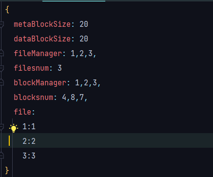
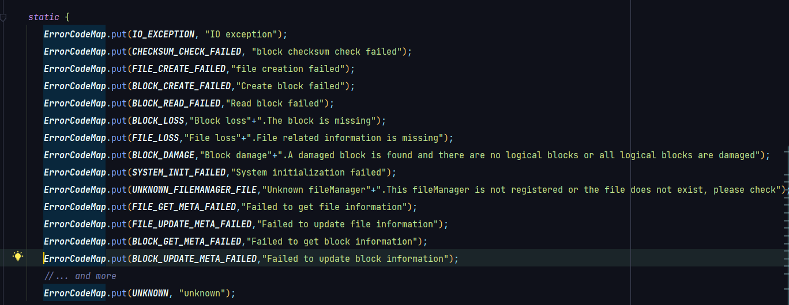
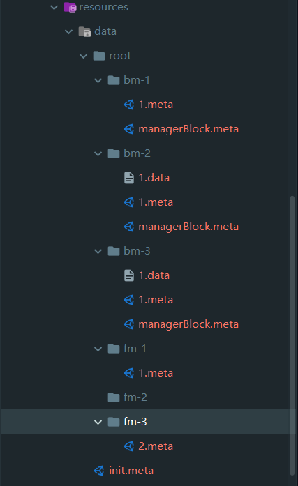
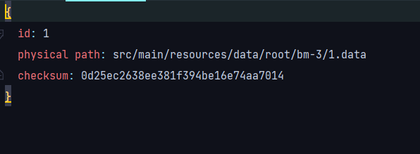
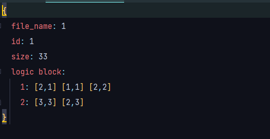

#说明文档
##1.思路：

###系统初始化：

从一个初始化文件中获取有哪些`FM`和`BM`，然后创建相应的对象，初始化文件中还包含文件与`FM`的对应关系

这是初始化文件的内容，包括块大小，FM和BM及其管理的文件和块的数量，还有文件与`FM`的对应关系

###创建文件：

就单单创建文件的`meta`文件，写入初始的文件名,`id`等，当向这个文件写入内容时，从命令行读取输入，转化为`byte`数组，根据块的大小判断存储这些内容需要的块的数量，创建相应的块。

###创建块：

首先随机选择一个`BM`，通过`BM`创建块，块的id是通过BM维护的一个变量来实现的，同时创建`.meta`和`.data`文件，
先向数据块写入对应的`byte`数组，然后将这个块的路径和`.data`文件生成的`checksum`保存在`.meta`文件中，完成文件创建

###文件修改：

根据光标的位置判断要修改文件的第几个块，把这个块取出来，然后再具体判断要修改到哪个字节，将这个块内容取出，拼接上新添加的内容成一个新的`byte`数组，然后创建相应数量的块，最后用这些块替换修改的块，排列到指定的位置

###文件读取：

首先根据文件`id`判断文件属于哪个`FM`，根据`FM`读取文件`meta`信息，获取文件是由哪几个块构成的，然后分别根据块的`id`和`BM`读取块的`meta`信息，获取块的`data`路径，读取`data`，拼接成完整内容，最后根据光标的位置和读取长度返回读取内容

###备份:

对于每个创建的块，随机选取一个`BM`来创建一个除了`id`不同其他都相同的块，并把这个块加入到这个文件对应的逻辑块中，每次读取文件时，就在对应位置的逻辑块中随机选取一个读取

##2.异常处理：

根据提供的异常类，自己加进一些自定义的异常，在代码中根据条件判断抛出什么样的异常，在`main`中捕获异常并显示异常信息

`CHECKSUM_CHECK_FAILED`：当读取块内容加密后与`checksum`不同时抛出

`FILE_CREATE_FAILED`：当表示块或者文件信息、块信息的文件创建失败时抛出

`BLOCK_CREATE_FAILED`：块创建失败时抛出

`BLOCK_READ_FAILED`：读取块失败时抛出

`BLOCK_LOSS`：块文件丢失了，没找到指定路径的块时抛出

`FILE_LOSS`：文件的`meta`信息丢失了

`BLOCK_DAMAGE`：发现坏块并且无法修复时或者所有逻辑块都坏了时抛出

`SYSTEM_INIT_FAILED`：文件系统初始化失败时抛出

`UNKNOWN_FILEMANAGER_FILE`：当指定的文件或者`FM`在系统中未找到时抛出

`FILE_GET_META_FAILED`：获取文件`meta`信息失败时抛出

`FILE_UPDATE_META_FAILED`：更新文件`meta`信息失败时抛出

`BLOCK_GET_META_FAILED`：获取块`meta`信息失败时抛出

`BLOCK_UPDATE_META_FAILED`：更新块`meta`信息失败时抛出

##3.理解

BM相当于磁盘或者服务器，用于管理其中的`block`，`FM`是文件管理者，`FM`管理`file`，`file`的`meta`文件储存`file`的相关信息，对应到`block`。`FM`更面向于人，`BM`隐式管理`block`，
文件由许多块组成，块最好备份，当某个块坏了，可以找到备用块，FM只知道管理文件的信息，具体怎么分配块由`BM`隐式实现

这是文件系统的目录

这是块`meta`的结构，包括`data`路径和文件校验码

这是文件`meta`的结构，包括文件名，大小，逻辑块等

##4.bonus:

###1.实现了文件系统的持久化：

主要是每次程序结束时将`FM`,`BM`,`FM`与`file`的对应关系存储到系统初始化文件中，当系统再次运行时读取初始化文件初始化系统

###2.简单的块修复：

当读取文件检测到坏块时，先将这个块移出逻辑块序列，然后找备份块，如果备份块完整，直接将备份块数据复制到损坏的块。决定要不要修复这个块主要看这个块有几个备份块，只有一个就要修复，
多于一个就先将这个块舍弃。如果所以备份块都坏了，那就抛异常，说明块全部损坏了

###3.系统重置与丢弃块复用：

系统重置清空所有`BM`下的块和`FM`下的文件，仅仅保留一些初始化要用到的文件。在每个`BM`中保留一个`managerBlock.meta`文件，其中储存这个`BM`中的被丢弃的块，当用户输入`clear`之后，这些块就会
变成空闲块，当需要新建块时就先查这个文件，有空闲块直接写入，更改块信息。丢弃的块是指最新的文件用不到的块。